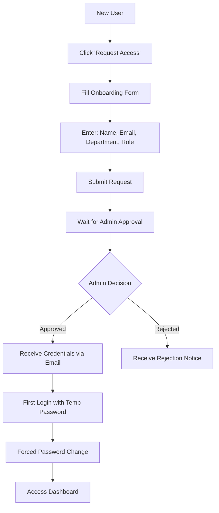
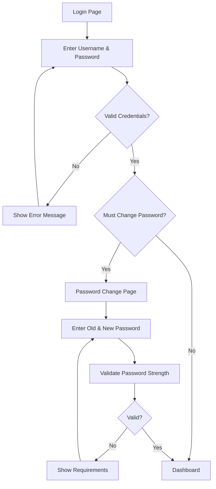
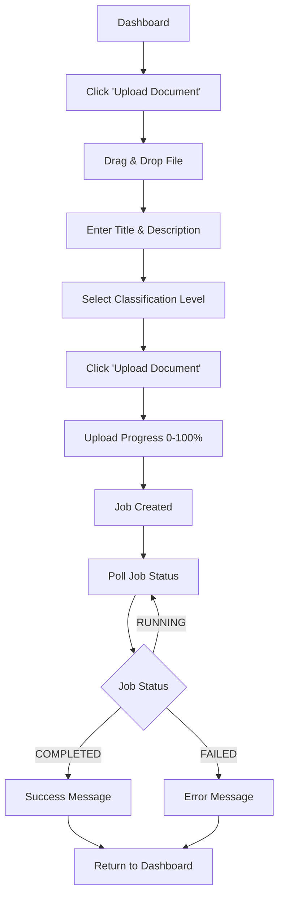
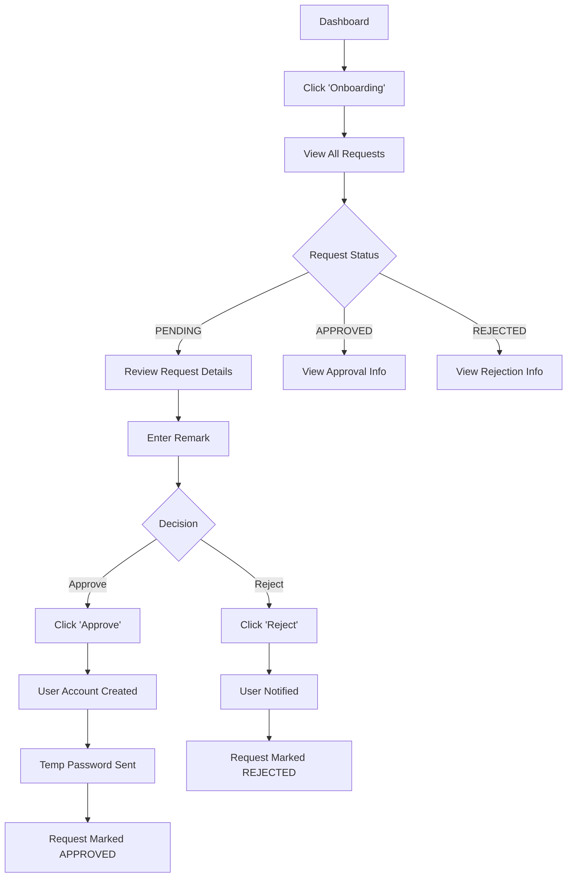
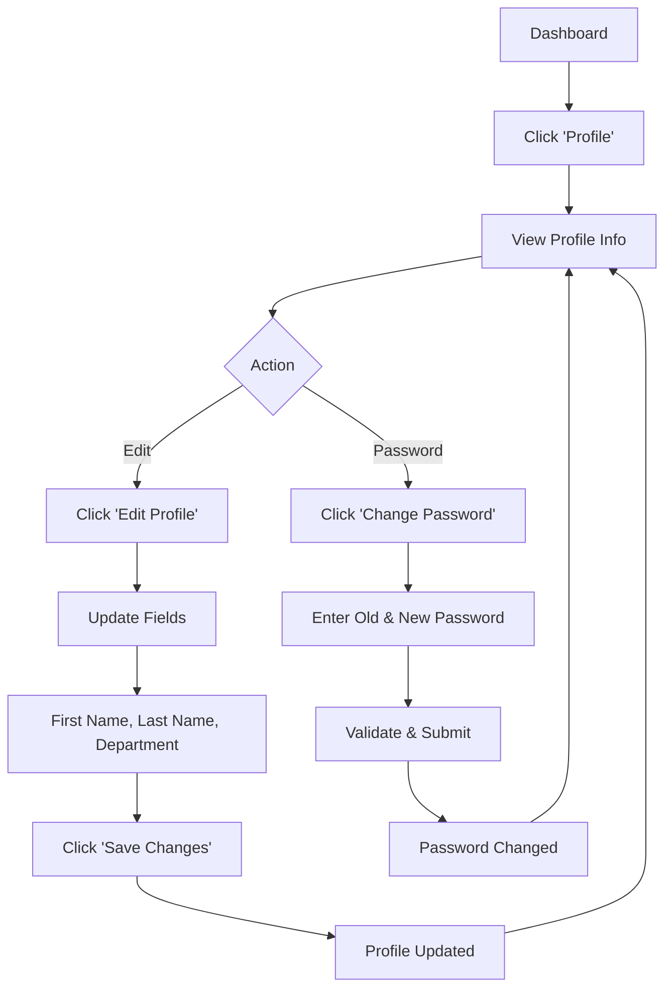

# Jalsetu Desktop Application - Complete Workflow Guide

## Overview

Jalsetu is a document management system with role-based access control. This guide covers all user workflows from login to document processing.

---

## 🔐 Authentication Workflows

### 1. New User Onboarding



**Steps:**
1. Click **"Request Access"** on login page
2. Fill form: Full Name, Email, Department, Requested Role
3. Submit request
4. Admin reviews and approves/rejects
5. If approved, receive temporary password
6. Login and change password

---

### 2. Regular Login Flow



**Steps:**
1. Enter username and password
2. Click **"Sign In"**
3. If first login → Change password
4. Otherwise → Redirect to Dashboard

**Password Requirements:**
- ✓ At least 8 characters
- ✓ One uppercase letter
- ✓ One lowercase letter
- ✓ One number
- ✓ One special character

---

## 👤 User Role Workflows

### ANALYST (Basic User)

**Available Features:**
- ✅ Dashboard (view only)
- ✅ Profile management
- ❌ Document upload
- ❌ Onboarding management

**Typical Workflow:**
1. Login → Dashboard
2. View stats and information
3. Update profile (name, department)
4. Change password if needed

---

### SENIOR_ANALYST (Document Manager)

**Available Features:**
- ✅ Dashboard
- ✅ Profile management
- ✅ **Document upload**
- ❌ Onboarding management

**Document Upload Workflow:**



**Detailed Steps:**

1. **Navigate to Upload**
   - Click **"Upload Document"** in sidebar

2. **Select File**
   - Drag & drop file into upload zone
   - OR click to browse
   - Supported: PDF, DOCX, TXT, JPG, PNG, WAV, MP3, M4A, FLAC, OGG

3. **Fill Metadata**
   - **Title**: Auto-filled from filename (editable)
   - **Description**: Optional details
   - **Classification**: Select security level
     - PUBLIC
     - RESTRICTED
     - CONFIDENTIAL
     - TOP_SECRET

4. **Upload & Monitor**
   - Click **"Upload Document"**
   - Watch progress bar (0-100%)
   - Job status updates automatically:
     - 🔄 RUNNING - Processing...
     - ✅ COMPLETED - Success!
     - ❌ FAILED - Error with message

5. **Result**
   - Success: Document processed and stored
   - Failure: Review error message and retry

---

### SUPER_ADMIN (Full Access)

**Available Features:**
- ✅ Dashboard
- ✅ Profile management
- ✅ Document upload
- ✅ **Onboarding management**

**Onboarding Management Workflow:**



**Detailed Steps:**

1. **Access Onboarding**
   - Click **"Onboarding"** in sidebar
   - View list of all requests

2. **Review Request**
   - See user details:
     - Full Name
     - Email
     - Requested Role
     - Department
     - Request Date

3. **Make Decision**
   - Enter **Remark** (required)
   - Click **"Approve"** or **"Reject"**

4. **Result**
   - **Approved**: 
     - User account created
     - Temporary password sent via email
     - User can login
   - **Rejected**:
     - User notified with remark
     - No account created

---

## 📊 Dashboard Workflow

**All Users See:**

1. **Welcome Section**
   - Personalized greeting
   - User's first name displayed

2. **Stats Cards**
   - Total Documents (placeholder: 0)
   - Processing Jobs (placeholder: 0)
   - Login Count (from user data)

3. **Quick Actions**
   - Filtered by user role
   - Click to navigate to features

**Navigation:**
- Sidebar menu (collapsible)
- Role-based menu items
- User profile at bottom
- Logout button

---

## 👤 Profile Management Workflow



**Steps:**

1. **View Profile**
   - Username (read-only)
   - Email (read-only)
   - First Name (editable)
   - Last Name (editable)
   - Department (editable)
   - Role (read-only)

2. **Edit Profile**
   - Click **"Edit Profile"**
   - Update fields
   - Click **"Save Changes"**
   - Success message displayed

3. **Change Password**
   - Click **"Change Password"**
   - Enter old password
   - Enter new password (with validation)
   - Confirm new password
   - Submit

---

## 🔄 Complete User Journey Examples

### Example 1: New Analyst Joins Team

1. **Day 1**: Submit onboarding request
2. **Day 2**: Admin approves → Receives temp password
3. **Day 2**: First login → Change password
4. **Day 2**: Access dashboard → View stats
5. **Day 3**: Update profile with full name
6. **Ongoing**: Monitor documents (view only)

---

### Example 2: Senior Analyst Uploads Document

1. Login to dashboard
2. Navigate to **Upload Document**
3. Drag PDF file into upload zone
4. Title auto-filled: "Q4_Financial_Report"
5. Add description: "Quarterly financial analysis"
6. Select classification: **CONFIDENTIAL**
7. Click **Upload Document**
8. Watch progress: 0% → 25% → 50% → 75% → 100%
9. Job status: RUNNING → COMPLETED
10. Success message: "Document processing completed!"
11. Return to dashboard

---

### Example 3: Super Admin Manages Onboarding

1. Login to dashboard
2. Navigate to **Onboarding**
3. See 2 pending requests:
   - Alice Johnson (Data Science, SENIOR_ANALYST)
   - Bob Williams (Finance, ANALYST)
4. Review Alice's request
5. Enter remark: "Approved based on manager recommendation"
6. Click **Approve**
7. System creates account for Alice
8. Temp password sent to alice@example.com
9. Request status updated to APPROVED
10. Review Bob's request
11. Enter remark: "Please resubmit with department head approval"
12. Click **Reject**
13. Bob notified of rejection

---

## 🔒 Security Features

### Token Management
- JWT access tokens (short-lived)
- Refresh tokens (long-lived)
- Automatic token refresh on expiry
- Secure storage (electron-store/localStorage)

### Session Handling
- Auto-logout on token expiry
- Manual logout available
- Session persists across app restarts

### Role-Based Access
- Menu items filtered by role
- Protected routes redirect unauthorized users
- API calls validate user permissions

---

## 📱 UI Navigation

### Sidebar Menu
- **Collapsible** (click hamburger icon)
- **Role-filtered** items
- **Active state** highlighting
- **User profile** section
- **Logout** button

### Page Structure
- **Header**: Page title and description
- **Content**: Main feature area
- **Cards**: Glassmorphism design
- **Animations**: Smooth transitions

---

## 🎨 Visual Feedback

### Loading States
- Spinner animations
- Progress bars
- Skeleton screens

### Success/Error Messages
- Toast notifications (top-right)
- Color-coded (green/red)
- Auto-dismiss after 4 seconds

### Form Validation
- Real-time feedback
- Error messages below fields
- Success indicators (checkmarks)

---

## 🔄 Data Flow

### Login Flow
```
User Input → authService.login() → Mock API / Backend
→ JWT Tokens → authStore → localStorage/electron-store
→ Redirect to Dashboard
```

### Document Upload Flow
```
File Selection → Validation → FormData Creation
→ ingestionService.uploadDocument() → Progress Updates
→ Job Created → Poll Job Status → Final Status
→ Success/Error Message
```

### Profile Update Flow
```
User Edits → Form Validation → authService.updateProfile()
→ Mock API / Backend → authStore Update
→ localStorage/electron-store → Success Message
```

---

## 🧪 Testing Workflows (Mock API)

### Test Scenario 1: Login as Different Roles

1. **SUPER_ADMIN**: `admin` / `Admin@123`
   - See all menu items
   - Access onboarding management

2. **SENIOR_ANALYST**: `analyst1` / `Analyst@123`
   - See upload menu
   - Cannot access onboarding

3. **ANALYST**: `user1` / `User@123`
   - Limited menu
   - View-only access

### Test Scenario 2: Document Upload

1. Login as `analyst1`
2. Upload test PDF
3. Watch progress simulation
4. See job status: RUNNING → COMPLETED (90% chance) or FAILED (10% chance)

### Test Scenario 3: Onboarding Approval

1. Login as `admin`
2. View 4 mock requests (2 pending, 1 approved, 1 rejected)
3. Approve/reject pending requests
4. See status updates

---

## 📋 Summary

**Key Workflows:**
1. ✅ Onboarding → Approval → First Login → Password Change
2. ✅ Regular Login → Dashboard → Feature Access
3. ✅ Document Upload → Progress → Job Status → Completion
4. ✅ Profile Management → Edit → Save
5. ✅ Onboarding Management → Review → Approve/Reject

**Role Hierarchy:**
- ANALYST < SENIOR_ANALYST < SUPER_ADMIN

**Security:**
- JWT authentication
- Role-based access control
- Secure credential storage

**User Experience:**
- DeepSeek-inspired dark UI
- Smooth animations
- Real-time feedback
- Toast notifications
